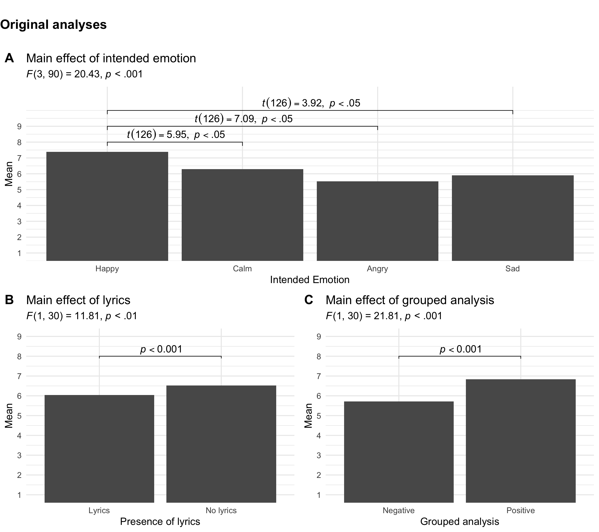
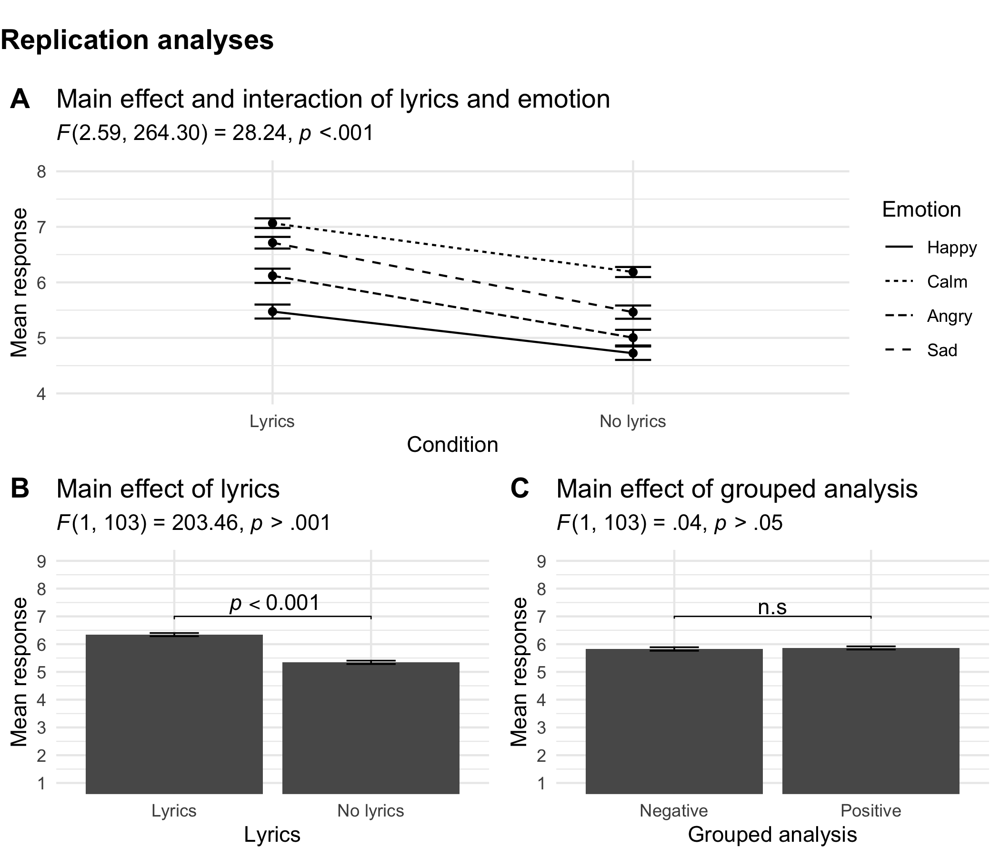

# Lyrics and Emotions Replication Study 

This repository contains all the materials for the short report submitted to _Music Perception_ as of December, 2020  article attempting to replicate [Songs and emotions: are lyrics and melody equal partners?](https://journals.sagepub.com/doi/10.1177/0305735606067168)

* [OSF Page](https://osf.io/g8a5p/) 

## Overview 

In this paper, we attempted to replicate the findings from a highly cited paper in the music psychology literature.
The original paper reports four sepearate experiments investigating the relationship between music, lyrics, and emotion.
Here we only attempt to generalize the findings of the first experiment reported in their manuscript.

The set of findings we sought to reprouce are listed below in Figure 1.

This included 

* Significant interaction with Gender 
* Main effect of Emotion
* Main effect of Lyrics

We chose to drop gender from our analyses, choosing to only focus on lyrics and emotion. 

Our experiment also found significant findings, but in the opposite direction.

The manuscript also has an additional analysis as well as suggestions to why we were not able to generalize these findings.

These include:

* Strong experimental effects 
* Type I error
* Empirical human error of data entry detected by [GRIM test](https://journals.sagepub.com/doi/abs/10.1177/1948550616673876).

## Experiment

The `experiment` directory also contains all materials used in running the experiment. 

* Running `experiment/lyrics.html` will launch the experiment in your browser.

